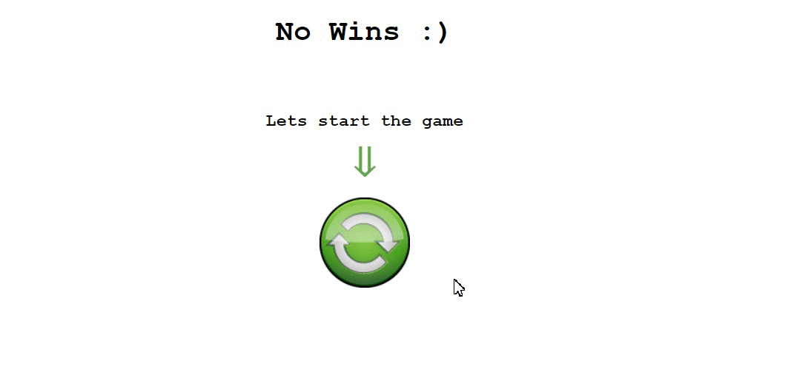

# **Marlinspike Slot** #

Full stack javascript application. The game which can display a random outcome generated on the server. 

Marlinspike Slot has been tested on major browsers Chrome/Opera/Firefox/Safari/IE and Device Mode (iPhone 5, Galaxy S5, iPad) on Chrome :)

## **START** ##

**!!!** go to root directory *marlinspike-slot/* and then:

1. **npm install**

1. **npm start**

1. Go to **http://127.0.0.1:777/**

### **BONUS** ###
After **10 tries** you will have the chance to get the bonus if you have **"No Win!"**.

### **Run server tests** ###

**!!!** go to root directory *marlinspike-slot/* and then:

1. **npm start**: and leave server working

1. **npm test**: (run tests ones)

Or run with watch flag - **mocha tests --recursive --watch**

**!!!**The recursive flag will find all files in subdirectories, and the watch flag will watch all your source and test files and rerun the tests when they change.
